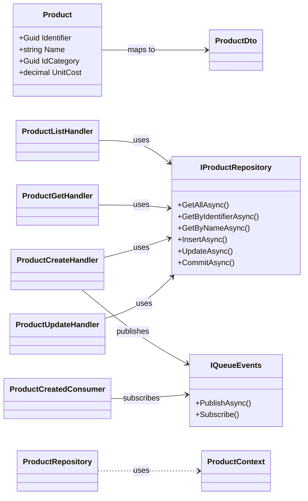
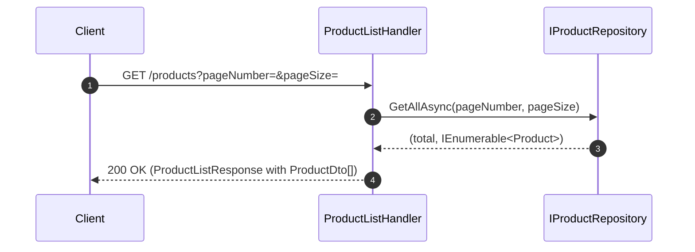
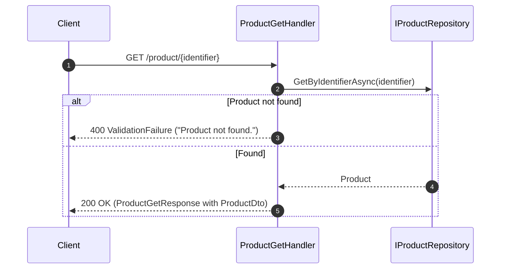
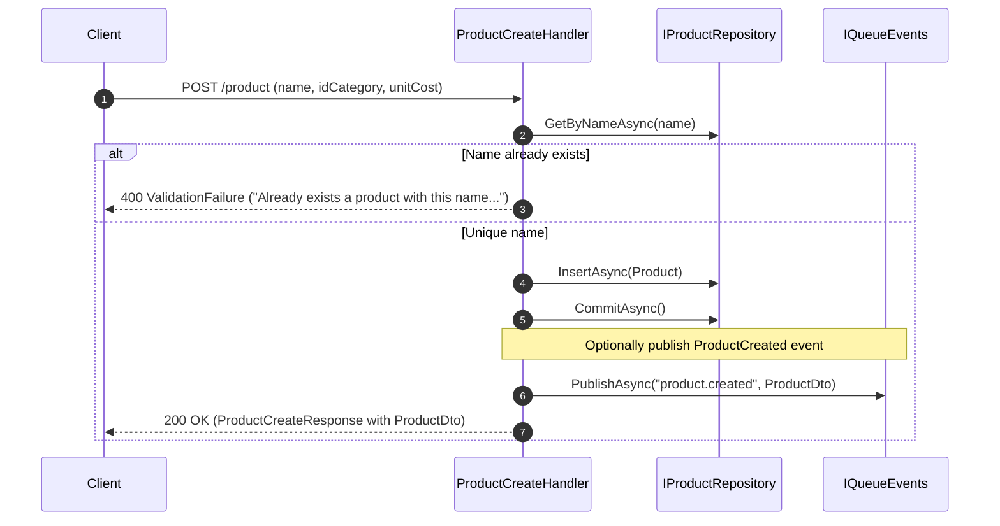
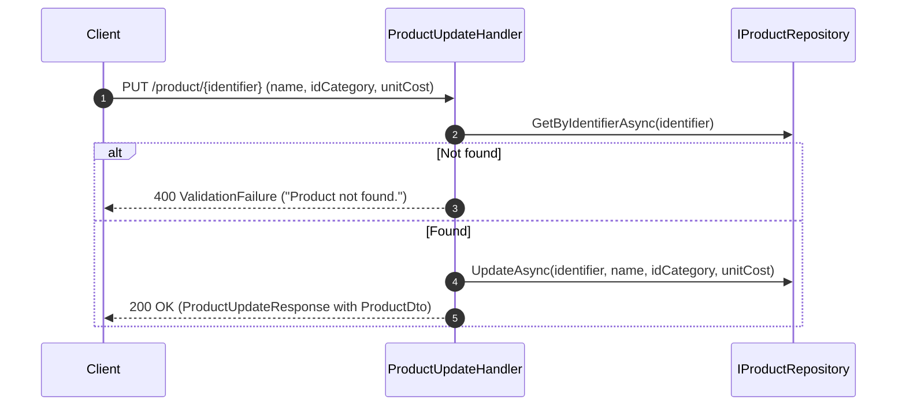

# Product Manager API

<!-- TOC -->
* [Product Manager API](#product-manager-api)
  * [Aquitetura](#aquitetura)
    * [Camada API](#camada-api)
    * [Camada Application](#camada-application)
    * [Camada Domain](#camada-domain)
    * [Camada Infrastructure](#camada-infrastructure)
    * [Projeto Tests](#projeto-tests)
  * [Execução local](#execução-local)
    * [Usando Docker e docker compose](#usando-docker-e-docker-compose)
  * [Decisões ténicas](#decisões-ténicas)
    * [Endpoints](#endpoints)
    * [Utilização de "record" ao invés de classes](#utilização-de-record-ao-invés-de-classes)
    * [Consumer RabbitMQ](#consumer-rabbitmq)
  * [UML](#uml)
    * [Request/Response and Repository Interaction (Sequence)](#requestresponse-and-repository-interaction-sequence)
<!-- TOC -->

## Aquitetura
Foi utilizado a arquitetura limpa neste projeto. Onde há várias camadas.

### Camada API
  * Contém as configurações gerais do projeto
  * "Recebe" as configurações das outras camadas por Inversion Of Control (IOC), ou seja, cada camada "sabe" como se configurar.

### Camada Application
  * Contém as implementações dos endpoints

### Camada Domain
  * Contém as entidades, as definições dos serviços e repostórios

### Camada Infrastructure
  * Contém as configurações de acesso a dados, sejam eles banco de dados ou uma fila de RabbitMq

### Projeto Tests
  * Contém o teste de arquitetura, prevenindo que uma camada seja importada, de forma errada, em uma outra camada.
  * Contém os testes gerais do projeto

## Execução local

### Usando Docker e docker compose

Siga os passos abaixo para executar a solução inteira (API + SQL Server + RabbitMQ) localmente utilizando o compose.yaml deste repositório.

- Pré‑requisitos
  - Docker Desktop (ou Docker Engine) instalado e em execução
  - Portas livres: 8080 (API), 1433 (SQL Server), 5672 e 15672 (RabbitMQ)

1) Configure o compose.yaml
- No arquivo compose.yaml na raiz do projeto, substitua os placeholders:
  - sqlserver.SA_PASSWORD: defina uma senha forte para o usuário sa (ex.: 1q2w3e4r@#$)
  - rabbitmq.RABBITMQ_DEFAULT_USER e rabbitmq.RABBITMQ_DEFAULT_PASS: defina usuário e senha para o RabbitMQ (ex.: guest/guest)
  - productmanager.api.DB_CONNECTION: use a string de conexão para o SQL Server dentro da rede do compose:
    Server=sqlserver,1433;Database=ProductManager;User ID=sa;Password=1q2w3e4r@#$;TrustServerCertificate=True;

2) Suba os containers
- No diretório raiz do repositório, execute:

```bash

docker compose up -d --build
```

3) Verifique os serviços e acesse a API
- Checar status: docker compose ps
- Logs da API: docker compose logs -f productmanager.api
- Swagger da API: http://localhost:8080
- RabbitMQ Management UI: http://localhost:15672 (use o usuário/senha configurados)

Observações importantes
- As migrações do EF Core são aplicadas automaticamente no startup da API.
- Variáveis de ambiente usadas pela API (mapeadas no compose):
  - DB_CONNECTION
  - RabbitMq__Host, RabbitMq__Username, RabbitMq__Password, RabbitMq__Port
- O compose cria volumes nomeados para persistir dados entre reinicializações: sqlserver_data e rabbitmq_data.

Encerrar e limpar
- Parar e remover containers: docker compose down
- Remover também os volumes (apaga dados): docker compose down -v

## Decisões ténicas

### Endpoints
Para os endpoints, decidi utilizar o FastEndpoint, que para o momento, tamanho do projeto e o objectivo, este framework serviu perfeitamente, facilitando o desenvolvimento e assim evitando criar alguns arquivos "desnecessários".

Para mais detalhes, veja sobre o FastEndpoints, acesse o site do framework.

É possível adicionar validações, com FluentValidation, que já vem integrado ao FastEndpoints. Bastando apenas criar a classe implemetando "AbstractValidator", criando as regras e no "bind" do payload a validação será executada, podendo ser "desabilitada" a validação automática para a manual. Veja mais detalhes sobre validações no link: https://fast-endpoints.com/docs/validation#request-dto-validation

Mais em: https://fast-endpoints.com/

### Utilização de "record" ao invés de classes
Foi decidido utilizar tipos "record" por serem "mais" leves e consumirem menos recurso do .Net. São uma boa opção para DTOs, considerando que os valores informados em um DTO geralmente não mudam seus valores, o record irá garantir que os valores não sejam alterados. Inclusive, auxiliando na performance.

### Consumer RabbitMQ
O consumer, inicialmente, seria criado dentro de um worker (basicamente um console application que não finaliza). Porém, novamente pelo tempo, decidi criar um BackgrdoundService. Mas, para um projeto maior, poderia ser uma Azure Function, por exemplo.

O serviço de enviar/obter dados da fila do RabbitMq estão na camada "Infrastructure" considerando que a mensgem que será trafegada é um dado, sendo um dado, pode vir desta camada. Mas poderia ser criado um serviço para fazer essa integração.

## UML
Abaixo uma visão abrangente dos componentes envolvendo Operações com o Produto (Listar, Obter, Criar, Atualizar e Excluir). Reflete a estrutura atual do projeto (FastEndpoints + Repositories + EF Core + Messaging).



### Request/Response and Repository Interaction (Sequence)

Product List


Product Get


Product Create


Product Update


Notas
- Handlers, responsáveis por executar as operações, implementam FastEndpoint a podem lançar erros de validações com o código de erro é 400 (Bad request)
- Operações de acesso banco de dados são efetuados com Entity Framework (ProductContext) na camada Infrastructure.
- No backgoundService chamado ProductCreatedConsumer se conecta ao RabbitMq, recebe as mensagens e persiste a mensagem recebida na tabela de log para auditoria.
